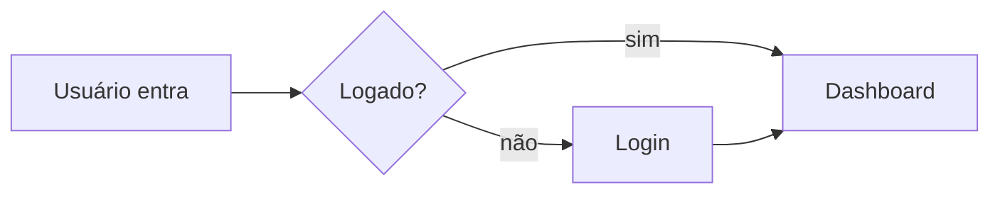

# PRD — `<NOME-DO-PRODUTO>` — vX.Y

> Product Requirements Document. Único documento que define **o que** o produto faz e **para quem**.
> Não fala **como** (isso é a Tech Spec).

**Owner:** `<PM/owner>`
**Eng lead:** `<lead>`
**Status:** `📝 draft | 👀 review | ✅ approved | 🚧 building | 🚀 shipped`
**Última atualização:** `<YYYY-MM-DD>`
**Discovery de origem:** `docs/discovery/<arquivo>.md`

---

## 1. TL;DR

> 5 linhas. Se um diretor lê só isso, precisa entender o produto.

```
[problema] → [solução] → [para quem] → [métrica de sucesso] → [quando]
```

---

## 2. Contexto e problema

> Cole/resuma da fase de discovery. Não comece do zero.

```
[...]
```

**Por que agora:**

```
[...]
```

---

## 3. Personas

| Persona | Cenário típico | Necessidade primária |
|---------|----------------|----------------------|
| `<persona 1>` | `<cenário>` | `<o que precisa>` |
| `<persona 2>` | `<cenário>` | `<o que precisa>` |

---

## 4. Escopo

### 4.1 Em escopo (v1)

- ✅ `<funcionalidade 1>`
- ✅ `<funcionalidade 2>`
- ✅ `<funcionalidade 3>`

### 4.2 Fora de escopo (v1)

- ❌ `<funcionalidade>`  — *razão*
- ❌ `<funcionalidade>`  — *razão*

### 4.3 Roadmap pós-v1 (não compromissivo)

- 🔜 `<v1.1>`
- 🔜 `<v2>`

---

## 5. User Stories

> Formato curto e numerado. Cada story vira uma branch/PR ou um conjunto de PRs.

| ID | Story | Persona | Prioridade |
|----|-------|---------|------------|
| US-01 | Como `<persona>`, quero `<ação>`, para `<benefício>`. | `<persona>` | P0 |
| US-02 | … | … | P1 |

**Legenda:** P0 = bloqueador de launch · P1 = importante · P2 = nice to have

---

## 6. Critérios de aceite (por story)

### US-01

**Dado** `<contexto>`
**Quando** `<ação>`
**Então** `<resultado observável>`

E também:
- [ ] Caso de erro: `<comportamento esperado>`
- [ ] Mensagem ao usuário: `<copy>`
- [ ] Acessibilidade: `<requisito>`
- [ ] Performance: `<budget>`

> Repita por story.

---

## 7. Requisitos não-funcionais

| Categoria | Requisito |
|-----------|-----------|
| Performance | LCP < 2.5s p75; INP < 200ms p75 |
| Acessibilidade | WCAG 2.1 AA |
| Internacionalização | pt-BR no MVP; estrutura preparada para i18n |
| Compatibilidade | últimas 2 versões de Chrome/Firefox/Safari/Edge |
| Segurança | LGPD; sem PII em logs; auth via `<provedor>` |
| Disponibilidade | 99.5% no MVP |
| Observabilidade | logs estruturados; eventos críticos rastreados |

---

## 8. Fluxos principais

> Use texto + diagramas. Mermaid é suficiente — o agente desenha.



---

## 9. Telas e estados

> Para cada tela: nome, propósito, estados (loading, vazio, erro, sucesso).

### Tela: `<nome>`

- **Propósito:** `[...]`
- **Componentes:** `[lista]`
- **Estados:** loading · vazio · erro · sucesso · degradado offline
- **Wireframe:** `<link ou anexo>`

---

## 10. Dados e privacidade

| Dado | Sensibilidade | Coleta | Retenção | Acesso |
|------|---------------|--------|----------|--------|
| `<email>` | PII | onboarding | até deleção | usuário + admin |
| `<...>` | … | … | … | … |

**Bases legais (LGPD):** `<execução de contrato | consentimento | legítimo interesse>`

**DPO/contato:** `<email>`

---

## 11. Métricas de sucesso

| Tipo | Métrica | Meta v1 | Como medir |
|------|---------|---------|------------|
| North Star | `<...>` | `<valor>` | `<dashboard>` |
| Adoção | `<DAU/WAU>` | `<...>` | `<...>` |
| Qualidade | `<error rate>` | `< X%` | `<...>` |
| Negócio | `<receita / economia>` | `<...>` | `<...>` |

---

## 12. Riscos & mitigação

| Risco | Probabilidade | Impacto | Mitigação |
|-------|---------------|---------|-----------|
| `<risco>` | A/M/B | A/M/B | `<plano>` |

---

## 13. Plano de lançamento

- **Beta fechado:** `<data>` — `<n usuários>`
- **Beta aberto:** `<data>`
- **GA:** `<data>`
- **Critério para GA:** `<lista>`

---

## 14. Aprovações

| Papel | Pessoa | Status |
|-------|--------|--------|
| Sponsor | `<...>` | ⬜ |
| Eng lead | `<...>` | ⬜ |
| Design | `<...>` | ⬜ |
| Segurança / DPO | `<...>` | ⬜ |

---

## Como instruir o agente nesta fase

```
Sua tarefa é me ajudar a transformar o Discovery Brief em PRD.
Não escreva código. Não escolha tecnologia.
Faça perguntas até preencher todas as seções com critérios verificáveis.
Para cada critério de aceite, escreva no formato Given/When/Then.
Marque com 🟡 qualquer ponto onde você inferiu algo no lugar de me perguntar.
Ao final, gere um Artifact com o PRD completo e liste o que ainda precisa de decisão.
```
