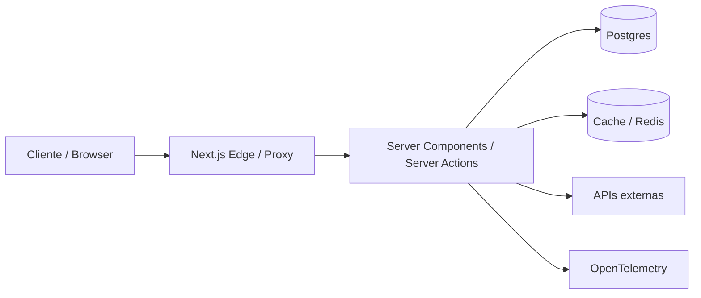
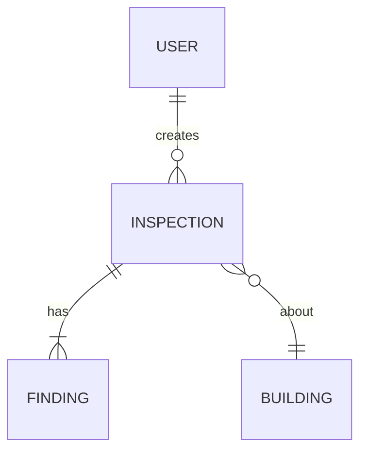

# Tech Spec — `<NOME-DO-PRODUTO>` — vX.Y

> Documento que traduz o PRD em arquitetura, contratos e decisões técnicas.
> Fonte de verdade para o agente decidir **como** construir.

**Owner:** `<eng lead>`
**Status:** `📝 draft | 👀 review | ✅ approved`
**PRD de origem:** `docs/prd/<arquivo>.md`
**Última atualização:** `<YYYY-MM-DD>`

---

## 1. Resumo executivo técnico

> 5 linhas. Stack, padrão arquitetural, decisões cruciais.

```
[ex: Next.js 16 App Router, Tailwind v4, Postgres + Drizzle, Auth por JWT,
deploy em Vercel, observabilidade via OpenTelemetry → Grafana Cloud.]
```

---

## 2. Arquitetura de alto nível



**Componentes:**

| Componente | Tecnologia | Responsabilidade |
|------------|------------|------------------|
| Frontend / SSR | Next.js 16, RSC, Server Actions | Renderização, mutações, autenticação na borda |
| Estilo | Tailwind v4 (`@theme` no CSS) | Design system tokens, utility classes |
| Banco | Postgres (`<provedor>`) + Drizzle ORM | Persistência transacional |
| Cache | Cache Components (`"use cache"`) + Redis (opcional) | Reduzir round-trips |
| Auth | `<NextAuth/Clerk/Supabase Auth>` | Sessão, RBAC |
| Observabilidade | OpenTelemetry → `<destino>` | Logs, traces, métricas |
| Storage | `<S3/R2/Drive>` | Arquivos do usuário |

---

## 3. Decisões-chave (referência a ADRs)

| # | Decisão | ADR |
|---|---------|-----|
| D1 | App Router + RSC default, sem Pages Router | `adr/0001-app-router.md` |
| D2 | Tailwind v4 com config CSS-first | `adr/0002-tailwind-v4.md` |
| D3 | Drizzle como ORM | `adr/0003-drizzle.md` |
| D4 | `<...>` | `<...>` |

> Sempre que houver dúvida sobre **por quê**, leia o ADR.

---

## 4. Modelo de domínio

> Entidades principais e relações. Diagrama + dicionário.



**Dicionário:**

| Entidade | Campos-chave | Notas |
|----------|--------------|-------|
| User | id, email, role | role: `admin` \| `inspector` \| `viewer` |
| Inspection | id, building_id, status, … | status: `draft` \| `in_progress` \| `done` |

---

## 5. Esquema de dados (referência)

> Migration inicial. Drizzle ou SQL puro.

```ts
// db/schema.ts
export const users = pgTable('users', { /* … */ });
export const inspections = pgTable('inspections', { /* … */ });
```

**Índices críticos:** liste por tabela.
**Política de soft-delete:** `<sim/não>` e por quê.
**Migrations:** `<ferramenta>` + processo de rollback.

---

## 6. Contratos (rotas, Server Actions, eventos)

### 6.1 Rotas Next.js (App Router)

| Rota | Tipo | Auth | Descrição |
|------|------|------|-----------|
| `/` | RSC | público | landing |
| `/(app)/dashboard` | RSC | autenticado | overview |
| `/(app)/inspections/[id]` | RSC | autenticado + RBAC | detalhe |
| `/api/webhooks/<x>` | Route Handler | assinado | webhook externo |

### 6.2 Server Actions

Use Server Actions para mutações. Cada action tem:

```ts
// app/(app)/inspections/actions.ts
'use server';

import { z } from 'zod';

const CreateInspectionInput = z.object({
  buildingId: z.string().uuid(),
  notes: z.string().max(2000).optional(),
});

export async function createInspection(input: unknown) {
  const data = CreateInspectionInput.parse(input);
  // ... auth check, db, revalidate
}
```

**Regras:**
- Sempre validar input com Zod (ou Valibot).
- Sempre verificar auth + autorização explicitamente.
- Sempre `revalidatePath`/`revalidateTag` no final, se mutou estado.
- Nunca expor erro cru ao cliente — mapear para mensagem segura.

### 6.3 Webhooks / API routes externas

| Endpoint | Método | Auth | Idempotência |
|----------|--------|------|--------------|
| `/api/webhooks/<x>` | POST | HMAC | sim, via `event_id` |

---

## 7. Caching

- **Default:** todo código dinâmico no request time (Next 16 default).
- **`"use cache"`:** declarar explicitamente em funções/páginas estáticas ou semi-estáticas.
- **Tags:** `revalidateTag('inspections')` após mutação.
- **CDN/Edge cache:** `<configuração>`.

---

## 8. Autenticação e autorização

- **Provedor:** `<...>`
- **Sessão:** cookie HTTP-only, SameSite=Lax, Secure em prod.
- **RBAC:** definido no banco, checado em **toda** Server Action e RSC sensível via helper `requireRole(role)`.
- **Sem checagem só no cliente.** Cliente é hint visual; servidor é fonte de verdade.

---

## 9. Observabilidade

| Sinal | Ferramenta | O que capturamos |
|-------|------------|------------------|
| Logs | `pino` estruturado | nível, traceId, userId (hash) |
| Traces | OpenTelemetry | rotas, queries DB, server actions |
| Métricas | OTel + `<destino>` | latência p50/p95/p99, error rate |
| Frontend | `<Sentry/PostHog>` | erros JS, web vitals |

**SLOs:**

| SLO | Alvo |
|-----|------|
| Disponibilidade | 99.5% |
| Latência p95 | < 800ms |
| Error rate | < 0.5% |

---

## 10. Performance budgets

| Métrica | Budget |
|---------|--------|
| LCP p75 | < 2.5s |
| INP p75 | < 200ms |
| CLS p75 | < 0.1 |
| JS inicial (gzipped) | < 150KB |
| Bundle por rota | < 250KB |

CI deve **falhar** o build se ultrapassar.

---

## 11. Segurança

| Item | Decisão |
|------|---------|
| Headers | CSP, HSTS, X-Frame-Options, Referrer-Policy via `proxy.ts` |
| Input | Zod em toda entrada de borda |
| Output | escape automático do React; `dangerouslySetInnerHTML` proibido sem ADR |
| Secrets | `.env`, nunca commitados; gerenciador `<...>` em prod |
| Dependências | `pnpm audit` em CI; Renovate / Dependabot |
| RCE / SSRF | revisão obrigatória em qualquer fetch a URL provida pelo usuário |
| Rate limiting | em rotas públicas e webhooks |
| LGPD | minimização, retenção definida, deleção pelo usuário |

> Mais detalhe em `07-deploy/01-security-checklist.md`.

---

## 12. Estratégia de testes (resumo)

> Detalhe em `06-testing/00-testing-strategy.md`.

- Unit (Vitest): lógica pura, schemas Zod, utilitários.
- Component (Testing Library): comportamento, estados, a11y.
- Integration: Server Actions com DB de teste.
- E2E (Playwright): fluxos críticos do PRD.
- Visual / smoke via browser subagent do Antigravity.

---

## 13. Riscos técnicos

| Risco | Mitigação |
|-------|-----------|
| `<dependência crítica>` | `<plano B>` |
| `<latência DB>` | `<índice / cache>` |
| `<vendor lock-in>` | `<adapter>` |

---

## 14. Faseamento técnico

| Fase | Entrega | Critério de "pronto" |
|------|---------|----------------------|
| Fase 1 | Skeleton + auth | login + RSC funcional + CI verde |
| Fase 2 | Domínio core | CRUD + testes |
| Fase 3 | Observabilidade + perf | dashboards + budgets passando |
| Fase 4 | Hardening + deploy | runbook executado em staging |

---

## 15. Aprovações

| Papel | Pessoa | Status |
|-------|--------|--------|
| Eng lead | `<...>` | ⬜ |
| SRE / DevOps | `<...>` | ⬜ |
| Segurança | `<...>` | ⬜ |
| Product | `<...>` | ⬜ |

---

## Como instruir o agente nesta fase

```
Sua tarefa é gerar a Tech Spec a partir do PRD aprovado em docs/prd/.
Para cada decisão técnica importante, abra um ADR em docs/spec/adr/ usando
o template de ADR. Não escreva código de implementação ainda.
Diagrame em Mermaid quando ajudar.
Marque com 🟡 onde você assumiu algo que precisa de validação humana.
Ao final, gere um Artifact com a Spec + lista de ADRs criados.
```
