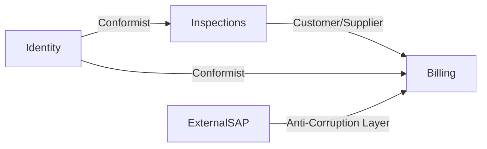
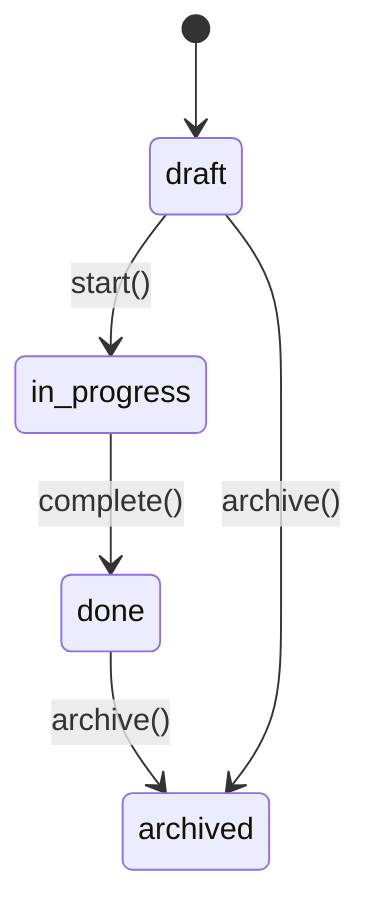

# Domain Model — `docs/spec/02-domain-model.md`

> Tradução tática do PRD para os blocos de DDD que o código vai espelhar.
> **Pré-requisito:** Linguagem Ubíqua fixada em [`docs/prd/01-glossary.md`](../02-prd/01-glossary-template.md).
> **Sucessor:** [`00-tech-spec.md`](00-tech-spec.md) referencia este arquivo para decisões de persistência, contratos e segurança.

**Owner:** `<eng lead>`
**Status:** `📝 draft | 👀 review | ✅ approved`
**Última atualização:** `<YYYY-MM-DD>`
**PRD de origem:** `docs/prd/<arquivo>.md`

---

## Quando este documento é obrigatório

- Produto tem **≥ 2 entidades** de negócio com regras (não puro CRUD sobre 1 tabela).
- Produto cruza **≥ 2 áreas de negócio** distintas (auth/identidade + faturamento + operação, etc.).
- Existe pelo menos **1 invariante** de negócio que não pode ser violada (saldo ≥ 0, status só transita por máquina definida, etc.).

Se nenhum dos três se aplica, este documento pode ser **substituído** por um parágrafo na Tech Spec §4 com a declaração explícita: *"Domínio CRUD sobre N entidades planas, sem invariantes além das do banco — DDD tático não se justifica."* Isso é uma decisão consciente, não omissão.

---

## 1. Subdomínios (estratégico)

> Classifique cada área de negócio por tipo. Direciona onde vale investir DDD pesado vs. onde basta CRUD bem feito.

| Subdomínio | Tipo | Por quê |
|------------|------|---------|
| `<ex: Inspeções>` | **Core** | É a razão do produto existir; vantagem competitiva mora aqui. |
| `<ex: Faturamento>` | **Supporting** | Necessário, mas commodity de negócio. |
| `<ex: Autenticação>` | **Generic** | Resolva com lib pronta (Supabase Auth, Clerk). Sem DDD. |

**Regra de investimento:**
- **Core:** todo arsenal DDD (agregados, VOs, eventos, repositories como porta, testes pesados, TDD obrigatório).
- **Supporting:** modelo claro + testes, mas evite over-engineering. ValueObjects só nos campos que carregam regra.
- **Generic:** **não** crie agregados; use o SDK do fornecedor diretamente atrás de uma fina anti-corruption layer.

---

## 2. Bounded Contexts (estratégico)

> Cada contexto tem **seu próprio** modelo, glossário e dono. Termos podem repetir nomes em contextos diferentes — mas significam coisas diferentes (`User` em Identidade ≠ `User` em Faturamento).

| Contexto | Subdomínio | Responsabilidade | Owner | Pasta no código |
|----------|-----------|------------------|-------|-----------------|
| `Identity` | Generic | Quem é o usuário, autenticação, sessão. | `<...>` | `src/domain/identity/` |
| `Inspections` | Core | Ciclo de vida da inspeção, achados, aprovação. | `<...>` | `src/domain/inspections/` |
| `Billing` | Supporting | Faturas, cobrança, recibos. | `<...>` | `src/domain/billing/` |

> Um contexto não conhece os blocos internos de outro. Comunicação cruza fronteira só por **evento de domínio** ou por **interface declarada** (anti-corruption layer).

### 2.1 Context Map



**Relacionamentos (use os termos canônicos):**

- **Shared Kernel** — duas equipes/contextos compartilham uma pequena parte do modelo e a versionam juntas. Caro: requer coordenação.
- **Customer/Supplier** — contexto upstream entrega contrato; downstream depende e negocia mudanças.
- **Conformist** — downstream consome contrato do upstream sem influência (downstream se adapta).
- **Anti-Corruption Layer (ACL)** — adapter que traduz modelo externo (sistema legado, SaaS, API) para o vocabulário do nosso contexto. **Obrigatório** para qualquer integração com modelo que não seguimos.
- **Open Host Service / Published Language** — contexto publica API estável para múltiplos consumidores.
- **Separate Ways** — duas áreas não se falam; deliberado.

> Marque no diagrama acima qual relacionamento se aplica a cada seta.

---

## 3. Tactical building blocks por contexto

Repita esta seção para cada **Bounded Context** acima. Não misture contextos numa única tabela.

### 3.1 Contexto `<NomeDoContexto>`

#### 3.1.1 Aggregate Roots e seus invariantes

Um **Aggregate** é um cluster de objetos que muda como um todo. O **Aggregate Root** é a única entidade pela qual o resto do código acessa o agregado. **Invariantes** são regras que o agregado **garante** — não cabe ao caller respeitá-las.

| Aggregate Root | Invariantes que protege | Entidades internas | Operações públicas |
|----------------|-------------------------|--------------------|--------------------|
| `Inspection` | • status só transita por máquina definida<br>• total de findings ≤ 200<br>• não aceita finding se status = `archived` | `Finding`, `Attachment` | `complete()`, `archive()`, `addFinding(input)`, `removeFinding(id)` |
| `<...>` | `<...>` | `<...>` | `<...>` |

**Regras práticas:**

- **Uma transação = um agregado.** Mutações que tocam ≥ 2 agregados → coordene por evento, não por transação distribuída.
- **Tamanho do agregado:** pequeno. Se um agregado tem > 5 entidades internas ou > 10 invariantes, provavelmente são dois agregados juntos.
- **Referência entre agregados é por ID** (`inspectionId`, `customerId`), nunca por objeto carregado em memória.
- **Construção via factory** quando há > 1 forma de criar o agregado (`Inspection.startFromTemplate(...)`, `Inspection.fromImport(...)`).

#### 3.1.2 Entities

| Entity | Pertence ao Aggregate | Identidade | Notas |
|--------|----------------------|------------|-------|
| `Finding` | `Inspection` | `id` (UUID) | Tem ciclo de vida próprio dentro da inspeção. |

> Entity = identidade ao longo do tempo (mesmo `id`, atributos mudam).
> Value Object = igualdade por valor (`Money(500, BRL) == Money(500, BRL)`).

#### 3.1.3 Value Objects

| VO | Campos | Invariantes | Onde aparece |
|----|--------|-------------|---------------|
| `Email` | `value: string` | regex válido, lowercase | `Identity.User`, `Billing.Invoice.recipient` |
| `Money` | `cents: number`, `currency: 'BRL' \| 'USD'` | `cents ≥ 0` | `Billing.Invoice.amount` |
| `InspectionStatus` | `value: 'draft' \| 'in_progress' \| 'done' \| 'archived'` | transições válidas (ver §3.1.5) | `Inspection.status` |

**Regra:** todo primitivo (`string`, `number`) que carrega regra vira VO. CPF, CEP, slug, e-mail, moeda, intervalo de datas. Construtor valida; mutação retorna **nova instância** (imutável).

#### 3.1.4 Domain Events

Eventos são fatos passados no domínio. Nomes no passado, sem tempo verbal de comando. **Schema versionado** (`v1`, `v2`) — eventos publicados são contrato com consumidores externos.

| Evento | Quando emitido | Payload | Consumidores |
|--------|----------------|---------|--------------|
| `InspectionCompleted` | `Inspection.complete()` | `{ inspectionId, completedAt, findingCount }` | `Billing` (gera fatura), `Notifications` (e-mail ao cliente) |
| `FindingAdded` | `Inspection.addFinding()` | `{ inspectionId, findingId, severity }` | `Analytics` (dashboard) |

**Regras:**

- Evento entra na linguagem ubíqua → adicione em [`docs/prd/01-glossary.md`](../02-prd/01-glossary-template.md).
- Payload é mínimo: o consumidor que precisa de mais detalhe consulta a Read Model via ID.
- Versão major do schema = ADR.

#### 3.1.5 Máquinas de estado (se houver)

Para todo campo de status, declare a máquina **antes** de codar a transição:



| De → Para | Operação | Pré-condição | Evento emitido |
|-----------|----------|--------------|----------------|
| `draft → in_progress` | `start()` | findings.length ≥ 0 | `InspectionStarted` |
| `in_progress → done` | `complete()` | findings.length ≥ 1 | `InspectionCompleted` |
| `done → archived` | `archive()` | — | `InspectionArchived` |

**Transições não declaradas são proibidas** — o agregado rejeita.

#### 3.1.6 Domain Services

Quando uma operação **não pertence** naturalmente a nenhum agregado (envolve múltiplos, ou é puro cálculo de domínio):

| Service | Operação | Por quê não está em um agregado |
|---------|----------|----------------------------------|
| `InspectionPricingService.priceFor(inspection)` | calcula valor a faturar | depende de `Inspection` + tabela de preços + região; nenhum dos três é dono natural |

> Domain Service ≠ Application Service. Domain Service expressa **regra de negócio pura**; vive em `src/domain/`. Application Service orquestra (`src/application/`).

#### 3.1.7 Repositories (porta, não implementação)

Interface declarada **dentro** do contexto. Implementação fica em `src/infrastructure/` e depende da interface — nunca o contrário.

```ts
// src/domain/inspections/ports/inspection-repository.ts
export interface InspectionRepository {
  byId(id: InspectionId): Promise<Inspection | null>;
  save(inspection: Inspection): Promise<void>;
  ofUser(userId: UserId): Promise<Inspection[]>;
}
```

**Regras:**

- Métodos da interface usam **tipos de domínio** (`Inspection`, `InspectionId`), não DTOs do banco.
- Sem método genérico tipo `find(filter)` — métodos expressam intenção de domínio (`ofUser`, `pendingApprovalOlderThan`, etc.).
- Teste de domínio usa `InMemoryInspectionRepository` (fake). Teste de integração usa o adapter Drizzle.

#### 3.1.8 Anti-Corruption Layers (se aplica)

Para cada integração com sistema externo cujo modelo **não** seguimos:

| Sistema externo | Adapter | Tradução |
|-----------------|---------|----------|
| SAP (faturamento legado) | `src/infrastructure/sap/sap-customer-adapter.ts` | `SAPCustomerRecord` → `Billing.Customer` |

> Sem ACL, o vocabulário do fornecedor vaza para o nosso domínio e contamina a linguagem ubíqua.

---

## 4. Reconciliação com a Linguagem Ubíqua

Antes do gate de aprovação deste documento:

- [ ] Todo Aggregate Root tem entrada em [`docs/prd/01-glossary.md`](../02-prd/01-glossary-template.md) com reflexo "classe `<Nome>` em `src/domain/<contexto>/`".
- [ ] Todo Domain Event tem entrada no glossário com reflexo "classe `<Nome>` em `src/domain/<contexto>/events/`".
- [ ] Todo papel/role usado em invariantes tem entrada no glossário.
- [ ] Não há **tradução silenciosa** — termo do PRD que virou nome diferente no código (ex.: PRD "Operador" → código `Worker`). Se aconteceu, ou rebatize o código, ou atualize o glossário.

> A regra do glossário ("termo só entra se aparece no código") fecha o ciclo: o que está aqui aparece lá; o que está lá precisa estar aqui.

---

## 5. O que sai do escopo deste documento

Para evitar inflar:

- ❌ **Schema de banco** — fica em [`00-tech-spec.md`](00-tech-spec.md) §5. Schema é tradução do modelo, não o modelo.
- ❌ **Rotas, Server Actions, contratos HTTP** — `00-tech-spec.md` §6.
- ❌ **Tecnologia de persistência (Drizzle, Prisma, SQL puro)** — ADR.
- ❌ **Implementação de eventos (broker, fila, tópico)** — ADR + Tech Spec §6.

Este documento é puramente **modelo de domínio**. Se você está escrevendo SQL aqui, errou de arquivo.

---

## 6. Como instruir o agente nesta fase

```
Sua tarefa é gerar o Domain Model a partir do PRD aprovado em docs/prd/ e
do glossário em docs/prd/01-glossary.md.

1. Releia o glossário inteiro. Para cada entrada, pergunte: é Aggregate
   Root, Entity, Value Object, Domain Event, Role, ou Status?
2. Identifique Bounded Contexts agrupando entradas por área de negócio.
   Cada contexto deve ter um significado próprio para cada termo.
3. Para o contexto Core (decidir qual a partir do PRD), produza tactical
   blocks completos: agregados + invariantes + entidades + VOs + eventos
   + máquinas de estado + services + repositories (interface).
4. Para contextos Supporting, produza apenas o essencial (agregados,
   invariantes, máquina de estado se houver).
5. Para contextos Generic, registre a decisão de "usar SDK do fornecedor
   sem agregado" — não invente agregado para wrap.
6. Reconcilie com o glossário: cada Aggregate Root e cada Domain Event
   precisa de entrada no glossário (ou marque 🟡 a adicionar).
7. Marque com 🟡 toda invariante que você assumiu sem confirmação do PRD.
8. Não escreva código. Este é doc de modelo.
9. Output: Artifact com o documento + lista de ADRs que esta modelagem
   demanda (ex.: "ADR para escolha do broker de eventos", "ADR para
   estratégia de identidade").
```

---

## 7. Anti-padrões

- ❌ Um único Bounded Context "Aplicação". → você não fez análise estratégica; releia subdomínios.
- ❌ Aggregate Root com 30 campos. → quase certo são 2-3 agregados.
- ❌ Invariante "validar no banco". → invariante é responsabilidade do agregado; banco é última linha de defesa.
- ❌ "Domain Event" que na verdade é payload de webhook externo. → isso é integração; trate via ACL ou Open Host Service.
- ❌ Repository com método `findAll(filter)`. → vire métodos por intenção (`pendingApproval()`, `assignedTo(userId)`).
- ❌ Domain Service que faz I/O. → não. Domain Service é puro; I/O fica no Application Service.
- ❌ Modelar o que **não** está no PRD. → DDD prematuro polui o modelo; pare no escopo aprovado.
